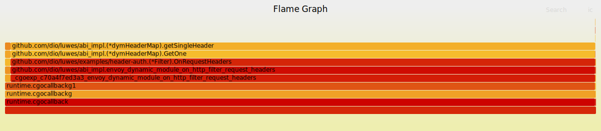
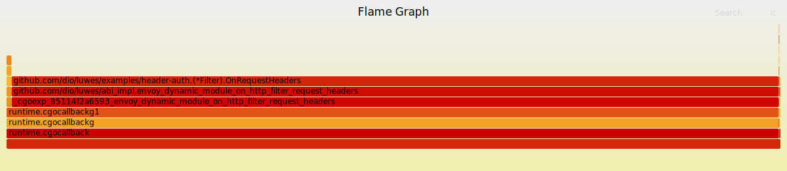

# luwes

[](https://github.com/dio/luwes/actions/workflows/ci.yml)
[](https://coveralls.io/github/dio/luwes?branch=main)

> **On the coverage number:** the badge excludes `abi_impl` (the CGO layer
> that calls into Envoy's C ABI) and `shared/mocks` (generated code). Both
> are covered by the e2e suite against a real Envoy 1.38.0 binary in CI.
> Every other unit-testable package is above 85%.

Zero-allocation Go SDK for Envoy dynamic modules. Drop-in replacement for
`github.com/envoyproxy/envoy/source/extensions/dynamic_modules/sdk/go`.

If you want a higher-level handler API with familiar Go types (`Request`,
`Writer`, `Header`), pooled per-request state, and built-in body buffering
and response observation, see [sahl](sahl/): the ergonomic layer built on
top of luwes. See [sahl/RATIONALE.md](sahl/RATIONALE.md) for why it exists.

See [RATIONALE.md](RATIONALE.md) for why this exists.

## Install

```
go get github.com/dio/luwes
```

Requires Envoy built with dynamic module support (ABI v0.1.0, Envoy >= 1.38.0).

## Usage

```go
// cmd/main.go
package main

import (
    sdk "github.com/dio/luwes"
    _   "github.com/dio/luwes/abi_impl"
    _   "your/filter/package" // calls sdk.Register in its init()
)

func init() {
    sdk.RegisterHttpFilterConfigFactories(sdk.Factories())
}

func main() {}
```

```
CGO_ENABLED=1 go build -trimpath -buildmode=c-shared -o dist/libmyfilter.so ./cmd
```

## API reference

### Header reads

| Method | Allocs (real CGO) | When to use |
|--------|-------------------|-------------|
| `GetOne(key) UnsafeEnvoyBuffer` | 1 | Simple reads where you immediately copy (`.ToString()`) |
| `GetOneInto(key, *UnsafeEnvoyBuffer) bool` | 0 | Hot path: header read + use within same callback |
| `Get(key) []UnsafeEnvoyBuffer` | 1+ | Multi-value headers |
| `GetAll() [][2]UnsafeEnvoyBuffer` | 1 | Iterate all headers |

**Why `GetOneInto` and not just `GetOne`?** The name follows Go's convention for
"write into caller-provided buffer" (see `io.ReadFull`, `binary.Read`). The reason
it's a separate method rather than a fixed `GetOne` is that the zero-alloc property
requires the caller to declare the buffer at the call site. That is a visible API
contract, not an implementation detail that can be hidden inside `GetOne`.

### Body reads

```go
// Read the complete request body (copies into Go memory).
// Call from OnRequestTrailers or when endOfStream is true in OnRequestBody.
body := utility.ReadWholeRequestBody(handle)

// Read body as chunks (zero-copy, Envoy-owned memory).
// Each UnsafeEnvoyBuffer is valid only within the current callback.
for _, chunk := range handle.ReceivedRequestBody().GetChunks() {
    _ = chunk.ToUnsafeBytes()
}
```

### Tracing, metrics, logging

See [examples/observability](examples/observability/) for a complete example covering:
`GetActiveSpan`, `SpawnChild`, `SetTag`, `DefineCounter`, `DefineHistogram`,
`IncrementCounterValue`, `RecordHistogramValue`, `LogEnabled`, `SetMetadata`.

### UnsafeEnvoyBuffer lifetime

Every `UnsafeEnvoyBuffer` points into Envoy-owned memory. It is valid only within
the callback in which it was obtained. Do not store it past the callback boundary.
Use `.ToString()` or `.ToBytes()` to copy into Go memory when you need to retain it.

## Examples

### Raw SDK

| Example | What it shows |
|---|---|
| [hello](examples/hello/) | Minimal filter: read `:path`, stamp response header |
| [header-auth](examples/header-auth/) | API key auth, sync.Pool, 0 allocs/op on hot path |
| [observability](examples/observability/) | Metrics, tracing, structured logging |

Each example has an `envoy.yaml` and a `README.md` with run instructions.

### sahl ergonomic layer

[sahl](sahl/) (`github.com/dio/luwes/sahl`) is a higher-level API built on top of
luwes. It trades 3 fixed allocations per request for a clean handler signature,
pooled per-request state, and built-in support for body buffering, response
observation, and per-listener factory isolation.

| Example | What it shows |
|---|---|
| [sahl/header-auth](sahl/examples/header-auth/) | Same auth filter as above, written with sahl |
| [sahl/auth](sahl/examples/auth/) | `RegisterFactory`: per-listener config isolation, two listeners from one .so |
| [sahl/decoder](sahl/examples/decoder/) | Body-aware routing: model name to upstream cluster, SSE token tap |
| [sahl/sse-tap](sahl/examples/sse-tap/) | Response observer: tap SSE streams for token usage without buffering |
| [sahl/spa](sahl/examples/spa/) | Embedded SPA (`//go:embed`) + JSON API handler, two filters in one .so |

See [sahl/README.md](sahl/README.md) for the full API reference including the
registration function comparison table and factory design. See
[sahl/RATIONALE.md](sahl/RATIONALE.md) for why the layer exists.

## Development

```
make build          # build .so for host (dev)
make run            # build + start Envoy (requires .bin/envoy)
make test           # go test -race ./...
make coverage       # coverage report
make lint           # golangci-lint
make bench          # alloc benchmarks
make flamegraph     # pprof allocs under load (requires hey)
make e2e            # integration tests against real Envoy
```

## Performance Report

Measured against Envoy 1.38.0, ABI v0.1.0, Apple M1 (Go 1.26, `-race` off).
Load test: `hey -n 1_000_000 -c 200` against the header-auth filter.

### Upstream SDK baseline

```
BenchmarkHeaderAuthAccept   96 B/op   1 allocs/op   ~118 ns/op
```

One allocation per request on every worker thread. At 50k RPS that is
50k heap allocations per second, per thread. The flamegraph showed a single
source: `getSingleHeader` (98.90% of all allocations), caused by `&valueView`
crossing the CGO boundary and escaping to the heap.

### luwes: handle pool (Phase 2)

```
BenchmarkHeaderAuthAccept   0 B/op   0 allocs/op   ~64 ns/op
```

`dymHttpFilterHandle` structs are pooled via `sync.Pool`. Pool return is in
`on_http_filter_destroy` (the guaranteed-last callback), not in
`stream_complete`, which can race with `destroy`. The flamegraph collapses
handle allocation to 0.94% (GC evictions only).

### luwes: GetOneInto (Phase 5)

`GetOneInto(key string, out *UnsafeEnvoyBuffer) bool` eliminates the
remaining CGO escape. The caller stack-allocates `out`; it is cast to
`*C.envoy_dynamic_module_type_envoy_buffer` via `unsafe.Pointer`. The
cast is safe: both structs are 16 bytes, `ptr` at offset 0, `length` at
offset 8.

```
BenchmarkGetOneInto   0 B/op   0 allocs/op   ~17 ns/op
```

The 98.90% in the flamegraph is gone. Usage:

```go
func (f *Filter) OnRequestHeaders(headers shared.HeaderMap, _ bool) shared.HeadersStatus {
    var key shared.UnsafeEnvoyBuffer
    if !headers.GetOneInto("x-api-key", &key) {
        f.handle.SendLocalResponse(401, nil, []byte(`{"error":"missing x-api-key"}`), "auth")
        return shared.HeadersStatusStop
    }
    f.handle.RequestHeaders().Set("x-user-id", key.ToUnsafeString())
    return shared.HeadersStatusContinue
}
```

### Flamegraphs

Generated via `make flamegraph` (go-torch + brendangregg/FlameGraph). Width
proportional to allocation count. Hover to see stack frames and counts.

**Before (upstream SDK)**

`getSingleHeader` owns a wide bar at 98.90%. Every `GetOne` call on a hit forces
`var valueView C.envoy_dynamic_module_type_envoy_buffer` onto the heap
because its address crosses the CGO boundary. The Go runtime cannot prove C
won't store the pointer, so it pins it on the heap. There is no way around
this with the current return-by-value API.



**After (luwes + GetOneInto)**

`getSingleHeader` is gone from the top. `GetOneInto` hands the C function a
pointer to a caller-owned buffer. The caller declares `var key shared.UnsafeEnvoyBuffer`,
which the compiler stack-allocates (its address stays in Go-managed space and
never escapes). The cast to `*C.envoy_dynamic_module_type_envoy_buffer` via
`unsafe.Pointer` is valid because both structs share the same layout: 16 bytes,
`ptr` at offset 0, `length` at offset 8.

What remains (the thin bars) is `(*Filter).OnRequestHeaders`: the
`RequestHeaders().Set("x-user-id", ...)` call, which allocates a new header
string. That is expected and unavoidable without a mutation API that writes
directly into Envoy's header table.



### Alloc benchmark summary

Numbers below are for the real CGO path (live Envoy). The fake/pure-Go path
used by `go test ./bench/...` reports higher counts because interface dispatch
blocks inlining and causes `var buf UnsafeEnvoyBuffer` to escape; that artifact
disappears on the CGO path where call sites are direct.

**Raw luwes (package `github.com/dio/luwes`)**

| Benchmark | upstream SDK | luwes |
|-----------|-------------|-------|
| HeaderAuthAccept | 1 alloc/op | **0 allocs/op** |
| GetOneInto (hit) | API does not exist | **0 allocs/op** |
| GetAll (10 headers) | 2 allocs/op | 1 alloc/op |

`GetOne` still allocates 1 on the real CGO path in both SDKs: `&valueView` escapes
to the heap at the CGO boundary regardless. The second flamegraph is clean because
header-auth was updated to call `GetOneInto` instead of `GetOne`. That is the
migration: replace `GetOne` with `GetOneInto` and declare a caller-owned buffer.
`HeaderAuthAccept` at 0 allocs/op is the result of both the handle pool (Phase 2)
and `GetOneInto` (Phase 5) together.

**sahl ergonomic layer (package `github.com/dio/luwes/sahl`)**

| Benchmark | allocs/op (CGO) | notes |
|-----------|----------------|-------|
| HandlerNoOp | 3 | baseline: Method + Path + Host pre-copy |
| HandlerAccept (Peek) | 3 | Peek is zero-alloc; cost is pre-copies only |
| HandlerAccept (Get, first) | 4 | +1 for ToString into cache |
| HandlerAccept (Get, cached) | 3 | cache hit: 0 additional allocs |
| HandlerReject (Send) | 4+ | SendLocalResponse body copy; unavoidable |

The 3-alloc floor in sahl is the cost of pre-copying Method, Path, and Host
into Go memory at callback entry. This is a deliberate ergonomic trade-off:
handlers can read `r.Method`, `r.Path`, `r.Host` as plain Go strings without
managing Envoy-owned memory lifetimes. Use raw luwes with `GetOneInto` if you
need 0 allocs end-to-end.

Use `r.Header.Peek` on the hot path: it returns an unsafe string pointing into
Envoy memory, zero-copy, valid only during the callback. Use `r.Header.Get` when
you need a value that outlives the handler (it copies once and caches; repeat
calls are free).

See `bench/sahl_bench_test.go` for the full breakdown with pprof-verified alloc
accounting per line.

## ABI

Vendored at `abi/abi.h` (pinned commit in `abi/VERSION`). Run `make sync-abi COMMIT=<hash>`
to update. An automated weekly check opens a PR when `envoy/main` drifts.
